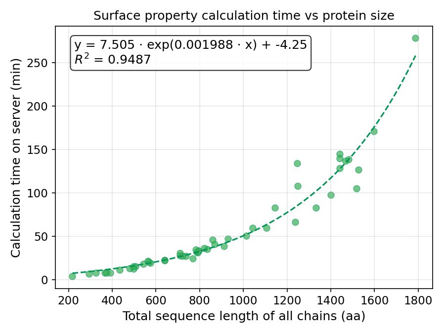

Prodes (fork)
===============
This is a fork of `Prodes <https://github.com/Tneijenhuis/prodes>`_, a package that
calculates structural features from 3D protein structures with a general focus on
the protein surface.

Prodes has been extensively validated in the prediction of retention times for
anion-exchange and cation-exchange chromatography, but the surface features it
calculates are applicable to a wide range of problems in protein science:

* **Ion-exchange chromatography** — prediction of protein retention times
* **Hydrophobic interaction chromatography** — surface hydrophobicity profiling
* **Prediction of hydrophobic patches** — identifying aggregation-prone regions
* **Protein–surface interactions** — non-specific binding to chromatography
  resins, filtration membranes, and container surfaces
* **Binding affinity** — characterising electrostatic contributions to
  protein–ligand and protein–protein interfaces
* **Developability assessment** — screening monoclonal antibodies and other
  therapeutic proteins for surface liabilities (hydrophobic patches, charge
  asymmetry)
* **Protein stability** — correlating surface properties with aggregation
  propensity and shelf-life in liquid formulations
* **Formulation development** — predicting colloidal stability and viscosity
  behaviour from surface charge distribution
* **Biologics manufacturing** — surface property screening for process
  development and purification design

The software is **completely free, including for commercial use**, licensed under
the MIT licence. Calculation takes **seconds to minutes per protein** on a
standard desktop computer.

.. note::

   It is strongly recommended to calculate pKa values using `PROPKA
   <https://github.com/jensengroup/propka>`_ (or an alternative pKa assignment
   tool) before running Prodes. Accurate protonation states are essential for
   meaningful electrostatic potential calculations. Prodes can read PROPKA
   output files directly via the ``--pka`` option.

The original algorithm and feature set are preserved unchanged. The improvements
in this fork are performance-oriented: NumPy vectorisation across the three
hotspots (SASA, surface grid, shell features) yields roughly a **12× speedup**
over the original pure-Python implementation.

Improvements in this fork
---------------------------

* **Vectorised Shrake-Rupley SASA** — the per-atom sphere point / neighbour
  distance test is now computed via NumPy broadcasting instead of Python loops
  (~8× speedup on the SASA phase).
* **Vectorised shell feature computation** — ``find_exit``, ``project_point``,
  and ``map_ep_to_plane`` have batch counterparts (``_batch``) that process all
  charged atoms simultaneously with ``np.einsum`` and broadcasting (~10×
  speedup on the shell phase, previously the slowest part of the pipeline).
* **Vectorised surface grid construction** — grid construction and cell filling
  refactored to use NumPy arrays throughout.
* **Bug fixes** — trimean edge case for small arrays, ``surface_exit`` ``None``
  handling in shell potential mapping, and a ``read_propka`` argument bug in
  the PDB parser.
* **Test suite** — unit and regression tests added, including a committed
  reference output file
  (``tests/data/ARH96693_prodes_orig_output.csv``) generated by the original
  unrefactored code. The regression test verifies that every feature column and
  every feature value produced by this fork matches the original output within
  tolerance.
* **Redundant feature analysis** — an R² analysis of the 105 original features
  across 820 proteins found significant redundancy. See
  `docs/redundant_feature_analysis.md <docs/redundant_feature_analysis.md>`_.

Calculation time and protein size
~~~~~~~~~~~~~~~~~~~~~~~~~~~~~~~~~~

   Surface property calculation time vs total sequence length of all chains.
   The relationship is exponential (R² = 0.95).

Calculation time scales **exponentially** with the total sequence length of
all chains in the structure. For proteins below ~500 residues (summed across
all chains), calculations typically complete in under 15 minutes on a single
CPU core. Above ~1,000 residues, calculation time rises sharply and can
exceed several hours.

If you experience long calculation times, consider splitting large structures
into individual chains or domains where biologically meaningful.

A full benchmark report, including server specifications and the fitted
exponential model, is available in
`docs/calculation_time_benchmark.md <docs/calculation_time_benchmark.md>`_.

CPU usage and parallelism
~~~~~~~~~~~~~~~~~~~~~~~~~~

The NumPy vectorisation in this fork speeds up calculations within a single
process, but it does **not** use multiple CPU cores — each Prodes run is
limited to one core. When processing many proteins, the recommended way to
achieve full throughput is to run multiple Prodes processes in parallel (one
protein per process), e.g. with ``multiprocessing``, GNU ``parallel``, or a
batch scheduler.

There is room for future improvement here: utilising multiple cores within a
single run would be particularly valuable for processing one large protein
quickly, as needed for standalone predictive services. This may be addressed
in a future release.

Memory usage
~~~~~~~~~~~~~~

The vectorised calculations allocate intermediate NumPy arrays whose size
grows with the number of surface points — so RAM usage is very likely related
to the size of the protein. To prevent out-of-memory crashes on machines with
limited RAM, the largest allocations (in ``find_exit_batch``) are chunked to
stay within a per-chunk memory budget controlled by ``PRODES_MEM_LIMIT_MB``
(default: 2048 MB). A lower limit means smaller chunks: less peak RAM, but
slower.

The limit can be set in three ways:

* **Environment variable** — set ``PRODES_MEM_LIMIT_MB`` in your shell or in
  a ``.env`` file (see ``.env.example``).
* **CLI flag** — ``python -m prodes in.pdb out.csv --mem-limit 2048``, which
  takes precedence over the environment variable.
* **Function argument** — when calling Prodes as a library, pass
  ``mem_limit_mb`` directly to ``prodes.run.calculate(...)`` (recommended in
  worker processes, so you don't rely on environment variables being
  inherited).

Monitor RAM usage during a run on your machine and adjust accordingly.
Currently working with 8192 on server with 128 GB RAM and 10 instances of
prodes, and 2048 on a 16 GB machine with one instance of prodes.
Keep in mind that when running multiple proteins with
multiprocessing, RAM usage is **cumulative** across processes — divide the
available memory by the number of parallel workers (and leave headroom for
the OS).

Output compatibility
~~~~~~~~~~~~~~~~~~~~~~

When the full feature set is used (the default), the output is identical to
the original Prodes. This is verified by the regression test in
``tests/test_sasa.py``, which compares against the committed reference file
``tests/data/ARH96693_prodes_orig_output.csv``.

Similar tools
~~~~~~~~~~~~~~~

Prodes occupies a niche between lightweight surface-property calculators and
full electrostatics solvers. The following tools address overlapping problems:

**General-purpose surface analysis:**

* `PEP-Patch / surface_analyses <https://github.com/liedllab/surface_analyses>`_
  (Liedl Lab, Innsbruck) — MIT licensed. Identifies positive/negative
  electrostatic and hydrophobic surface patches with area quantification. Uses
  APBS for electrostatics and mdtraj for surface generation. Does not calculate
  pI, dipole, shape descriptors, or the full statistical suite Prodes provides.
  Hoerschinger et al., *J. Chem. Inf. Model.* 2023,
  `DOI: 10.1021/acs.jcim.3c01490 <https://doi.org/10.1021/acs.jcim.3c01490>`_.

* `APBS + PDB2PQR <https://github.com/Electrostatics/apbs>`_
  (Electrostatics Consortium) — BSD-3-Clause. The industry-standard
  Poisson-Boltzmann electrostatics solver. Produces a 3D potential grid but
  does not identify patches or compute summary statistics directly. PEP-Patch
  wraps APBS for patch analysis.

* `Protein-Sol Patches <https://protein-sol.manchester.ac.uk/patches>`_
  (University of Manchester) — web server only, no source code. Charged and
  hydrophobic patch identification with pH-dependent properties. Hebditch &
  Warwicker, *Sci. Rep.* 2019,
  `DOI: 10.1038/s41598-018-36950-8 <https://doi.org/10.1038/s41598-018-36950-8>`_.

* `MultiPIPSA <https://pipsa.h-its.org>`_ (HITS / EBRAINS) — compares
  electrostatic potentials between proteins for similarity clustering. Uses
  APBS under the hood. Does not quantify individual patch sizes.

**Antibody-specific tools:**

* `PROPERMAB <https://github.com/regeneron-mpds/propermab>`_ (Regeneron) —
  34 developability features including hydrophobic/positive/negative patch
  areas, CDR-localised versions, charge asymmetry. Antibody Fv-specific.
  License terms require verification. Li et al., *mAbs* 2025, 17:2474521.

* `TAP <https://opig.stats.ox.ac.uk/webapps/sabdab-sabpred/TAP>`_ (OPIG,
  Oxford) — Therapeutic Antibody Profiler calculating patches of surface
  hydrophobicity (PSH), positive charge (PPC), and negative charge (PNC).
  No source code publicly available. Raybould et al., *PNAS* 2019,
  `DOI: 10.1073/pnas.1810576116 <https://doi.org/10.1073/pnas.1810576116>`_.

* `TNP <https://github.com/oxpig/TNP>`_ (OPIG, Oxford) — BSD-3-Clause.
  Therapeutic Nanobody Profiler with PSH/PPC/PNC calculations. Source
  available but nanobody-specific. Gordon et al., 2025,
  `DOI: 10.1101/2025.08.11.669635 <https://doi.org/10.1101/2025.08.11.669635>`_.

Prodes differs from these tools in that it computes a comprehensive set of
summary statistics (mean, trimean, median, sum, std over full/positive/negative
subsets) for both electrostatic and hydrophobic surface potentials, plus
far-field shell electrostatics, pI, dipole moment, and per-residue surface
fractions — all from a single command, with no external solver dependency.

Requirements
~~~~~~~~~~~~~~

All dependencies are pinned to exact versions for reproducibility and stability.

Installation
~~~~~~~~~~~~~

**Option 1: Conda / Mamba (recommended)**

Clone this repository and create a dedicated conda environment using the
committed ``environment.yml`` (runtime dependencies only)::

    conda env create -n prodes -f environment.yml
    conda activate prodes

Or with mamba::

    mamba env create -n prodes -f environment.yml
    conda activate prodes

For **development**, additionally apply ``environment_dev.yml`` which adds
testing, linting, type-checking, and documentation tools::

    conda env update -n prodes -f environment_dev.yml
    # or: mamba env update -n prodes -f environment_dev.yml

**Option 2: Pip inside a conda environment**

Create a minimal conda environment, then install with pip::

    conda create -n prodes python=3.13
    conda activate prodes
    pip install -e .

For development::

    pip install -e ".[dev]"

Getting started
~~~~~~~~~~~~~~~~~~
ProDes can be used as a module or via the installed script by running

``python -m prodes [infile] [outfile] [options]``

The infile requires to be a PDB file and the outfile a csv.

``python -m prodes --help``

will return the list of options available, which include:

* Specific pH
* Specific surface probe size
* Custom pKa values

Prodes as a module examples
-------------------------------
To run Prodes and perform a similar action as the commandline implementation simply use

.. code-block:: python

    import prodes
    prodes.run_prodes("./tests/data/1GDW.pdb", "example.csv")

Alternatively, the surface area of a protein can be calculated by running a script similar to

.. code-block:: python

    from prodes.io.parser import PDBparser
    from prodes.calculations import grid_wizard, sasa

    structure = PDBparser().parse("./tests/data/1GDW.pdb")
    grid = grid_wizard.Grid(10)
    grid.construct_cells(structure.heavy_atoms)
    grid.fill_cells(structure.heavy_atoms)

    sasa.shrake_rupley(grid)

    print(structure.surface_area())

How to cite
~~~~~~~~~~~~~~~

If this package is useful for you, please cite the original Prodes publication:

Neijenhuis, T., Le Bussy, O., Geldhof, G., Klijn, M. E., & Ottens, M. (2024). Predicting protein retention in ion-exchange chromatography using an open source QSPR workflow. Biotechnology Journal, 19, e2300708. https://doi.org/10.1002/biot.202300708
