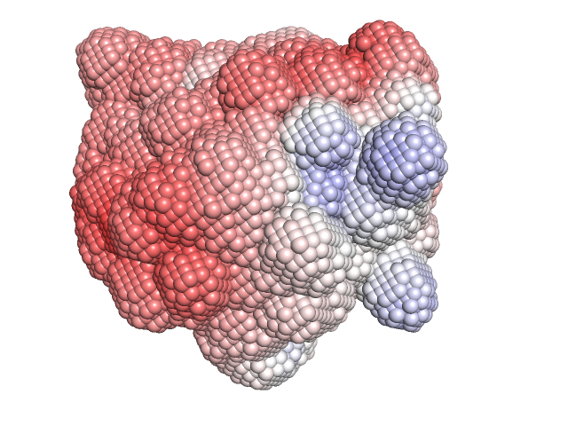
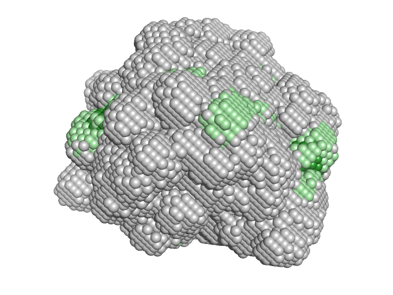
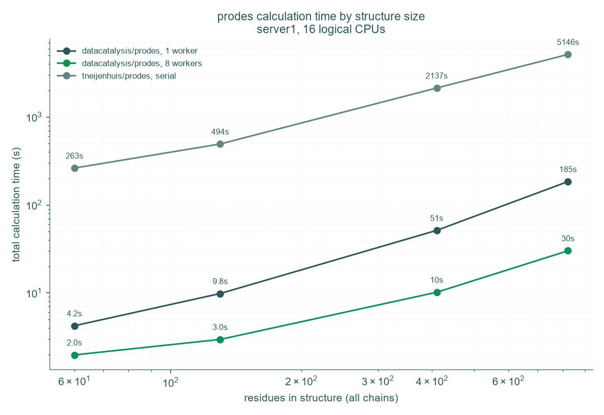
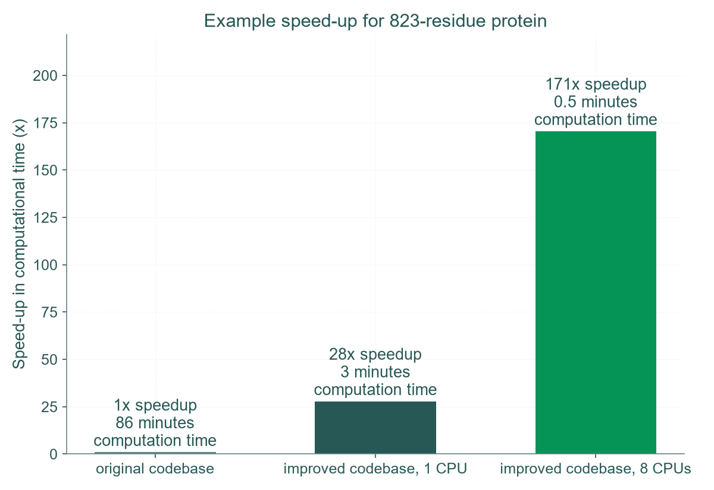

Prodes: Protein Descriptors
============================

**Prodes turns a 3D protein structure into numbers describing the surface properties.** You give it a PDB file, and it gives you a row in a CSV file with 54 columns describing the surface of that protein: how much of it is charged, how much of it is hydrophobic, how those properties are spread out across the surface, and how the picture changes with pH.

Those columns are designed to be used directly as the input features of a machine learning or QSPR model. If you have measured something about a set of proteins (a retention time, an aggregation onset, a viscosity, a titre) and you want to predict it for proteins you have not measured, Prodes gives you the X side of that problem from structure alone.

Prodes is **completely free, including for commercial use**, under the MIT licence. It needs no external electrostatics solver, no licence server and no web upload. A protein under 1000 residues should only take a few minutes on a normal desktop computer, and seconds on a dedicated linux server.

**Jump to:** `Installation`_ | `Quick start`_ | `Viewing the surface`_ | `The output bundle`_ | `Ionic strength and screening`_ | `Using the features in a model`_ | `pKa values and protonation states`_ | `Using Prodes from Python`_ | `Speed`_ | `How to cite`_

This is a fork of `tneijenhuis/prodes <https://github.com/tneijenhuis/prodes>`_, a package written by `Tim Neijenhuis <https://www.linkedin.com/in/tim-neijenhuis>`_ during his Ph.D. at the `Marcel Ottens group <https://www.tudelft.nl/en/faculty-of-applied-sciences/about-faculty/departments/biotechnology/research-sections/bioprocess-engineering/marcel-ottens-group/>`_ at the `Delft University of Technology (TU Delft) <https://www.tudelft.nl/>`_. Currently this fork preserves the original algorithm. The changes are performance (a 170x speedup for many proteins, see `Speed`_) and a reduced, non-redundant default feature set (see `The reduced feature set`_).

What you can use it for
------------------------

Prodes was originally built and validated for predicting retention times in anion-exchange and cation-exchange chromatography, and it is well tested there. But surface charge and surface hydrophobicity drive a great many things in protein science, so the same features have been applied to:

* **Hydrophobic interaction chromatography** — surface hydrophobicity profiling
* **Aggregation propensity** — identifying aggregation-prone surface regions
* **Protein–surface interactions** — non-specific binding to chromatography resins, filtration membranes and container surfaces
* **Binding affinity** — the electrostatic contribution to protein–ligand and protein–protein interfaces
* **Developability of biologics** — screening monoclonal antibodies and other therapeutic proteins for surface liabilities such as high surface hydrophobicity and charge asymmetry
* **Protein stability** — correlating surface properties with aggregation propensity and shelf life in liquid formulations
* **Formulation development** — predicting colloidal stability and viscosity behaviour from the surface charge distribution
* **Biologics manufacturing** — surface property screening for process development and purification design

Installation
-------------

Python Environment
~~~~~~~~~~~~~~~~~~~

We suggest setting up a specific python environment for Prodes, because Prodes pins specific versions of NumPy and pandas for increased reproducibility and stability. Installing it into the same environment as your other analysis scripts could change the NumPy version underneath them and break something that worked yesterday.

We suggest using **conda** to manage your environments. You can install via `Miniforge <https://conda-forge.org/download/>`_, which is the free, no-strings conda distribution. **mamba** is a drop-in faster replacement; everywhere below you can type ``mamba`` instead of ``conda`` if you have it.

Prodes requires **Python 3.13**.

Installing as a user
~~~~~~~~~~~~~~~~~~~~~

.. code-block:: text

    conda create -n prodes python=3.13
    conda activate prodes
    pip install git+https://github.com/datacatalysis/prodes.git
    conda install conda-forge::propka

The fourth line adds `PROPKA <https://github.com/jensengroup/propka>`_, which is a separate program by the Jensen group that predicts the pKa of each individual residue in your structure. Prodes does not need it to run, but you should use it: it takes seconds, it works on Windows, macOS and Linux, and it makes the charge-related features considerably more realistic. See `pKa values and protonation states`_. If you prefer, ``pip install propka`` does the same job.

Installing as a developer
~~~~~~~~~~~~~~~~~~~~~~~~~~

.. code-block:: text

    git clone https://github.com/datacatalysis/prodes.git
    cd prodes
    conda env create -n prodes -f environment.yml
    conda env update -n prodes -f environment_dev.yml
    conda activate prodes
    pre-commit install

Note that ``environment.yml`` already installs Prodes itself, in editable mode and includes PROPKA.

Check that it worked:

.. code-block:: text

    pytest                      # run the test suite
    pre-commit run --all-files  # lint and type-check the whole repository

Quick start
------------

Activate the environment, then run these three commands on your structure:

.. code-block:: text

    conda activate prodes

    propka3 1GDW.pdb                                                  # predict per-residue pKa values
    python -m prodes.io.pka_converter 1GDW.pka propka -o 1GDW_pka.json  # convert them for Prodes
    python -m prodes 1GDW.pdb 1GDW.zip --ph 7.4 --pka 1GDW_pka.json   # calculate the features

That writes ``1GDW.zip``, a bundle holding the 54 features, the surface points they were calculated from, and ready-to-open viewer scripts. On a small protein the whole thing takes seconds.

See `Viewing the surface`_ to look at the result.

PROPKA works out the pKa of every titratable residue *in its actual structural context*, because a buried aspartate and an exposed one titrate at quite different pH values. Without it (leave off ``--pka``), Prodes falls back to one textbook pKa per residue type. See `pKa values and protonation states`_.

To see every option:

.. code-block:: text

    python -m prodes --help

The ones you are most likely to want:

* ``--ph`` — the pH at which to compute protonation states (default 7). Charge features change substantially with this, so set it to the pH of your buffer.
* ``--pka`` — supply per-residue pKa values from PROPKA or a similar tool. Recommended, as above; see `pKa values and protonation states`_.
* ``--probe`` — the radius of the solvent probe used for the surface calculation (default 1.4 Å, i.e. water).
* ``--full-features`` — write the original 105-feature set instead of the reduced 54. See `The reduced feature set`_.
* ``--n-workers``, ``--chunksize``, ``--mem-limit`` — CPU and memory tuning. You can ignore all three; the defaults are sensible. See `Speed`_.

Viewing the surface
--------------------

Prodes does not only return numbers. Every run also produces two ready-made views of the protein surface it measured, so you can see where the charge and the hydrophobic patches actually are.

+-------------------------------+-------------------------------+
| |ep|                          | |phobic|                      |
+===============================+===============================+
| **Electrostatic potential.**  | **Hydrophobicity.** Grey is   |
| Red is negative, blue         | hydrophilic, pale green       |
| positive, white near zero.    | hydrophobic, dark green       |
|                               | strongly so.                  |
+-------------------------------+-------------------------------+

Unpack the bundle and open one of the PyMOL scripts from inside the directory:

.. code-block:: text

    unzip 1GDW.zip
    cd 1GDW
    pymol 1GDW_ep.pml                 # electrostatic potential
    pymol 1GDW_hydrophobicity.pml     # hydrophobicity

The ``.pml`` files are PyMOL scripts: plain text files of PyMOL commands that load the structure and colour its surface in one step, so there is nothing to set up by hand. The ``.cxc`` files do the same for ChimeraX. The paths inside them are relative, so they only work when opened from inside the unpacked directory. If PyMOL is already open, use File, Run Script instead.

**Reading the colours**

* **Electrostatic potential.** The scale is taken from each protein's own range, so no patch is ever clipped. The limit used is written into the script, and comparing two proteins directly means setting the same limit on both.
* **Hydrophobicity.** The two green cutoffs are fixed rather than per-protein, so the same green means the same hydrophobicity on any structure and two proteins can be compared as they are.

Both views are drawn from the same surface points, so a patch in one lines up exactly with the same place in the other.

**Showing the residues underneath**

Both scripts already load the structure behind the surface, as a grey cartoon with the relevant side chains picked out: red and blue for acidic and basic in the potential view, forest green for the hydrophobic residues in the hydrophobicity view. It is hidden only because the cloud is opaque. To see which residues produce a patch, make the cloud see-through:

.. code-block:: text

    set sphere_transparency, 0.4, surface_ep        # potential view
    set sphere_transparency, 0.4, hydrophobicity    # hydrophobicity view

Raise or lower the number to taste. Much above 0.5 and the surface colours start to wash out. Toggling the surface object off in the PyMOL object panel works too, and leaves the residues on their own.

The residues shown in green are those the selected hydrophobicity scale scores as hydrophobic, so they follow ``--hydro`` rather than being a fixed list. Note that histidine is only partly charged at pH 7, and that Prodes also places a charge at each chain terminus, so a charged patch may have no coloured side chain beneath it.

**ChimeraX**

The ``.cxc`` scripts are provided for ChimeraX users and are written to mirror the PyMOL ones, but they have not been tested. If one does not behave, the PyMOL scripts are the reference; please open an issue.

Input files
------------

Prodes reads ``.pdb`` files and ``.pdb.zip`` archives holding exactly one structure; an archive is unpacked to a temporary directory and read from there.

The ``ID`` column of the output is **the file name with its last extension removed**, taken from the file you named rather than from anything inside it. So ``1GDW.pdb`` and ``1GDW.pdb.zip`` both give ``1GDW``, an archive called ``bar.pdb.zip`` gives ``bar`` whatever the member inside it is called, and a file called ``1abc.ent.pdb`` gives ``1abc.ent`` rather than ``1abc``.

Name your files the way you want your rows labelled.

The output bundle
-----------------

One run takes one structure and writes one zip bundle. Nothing is appended to anything, so runs are independent and safe to parallelise. The output path must end in ``.zip``.

Unpacked, the bundle holds:

.. code-block:: text

    1GDW/
      1GDW_features.csv              the 54 features, one row, first column ID
      1GDW_surface_points.csv        every surface point: x, y, z, potential, hydrophobicity
      1GDW_ep.pml                    PyMOL, coloured by electrostatic potential
      1GDW_hydrophobicity.pml        PyMOL, coloured by hydrophobicity
      1GDW_ep.cxc                    ChimeraX, electrostatic potential
      1GDW_hydrophobicity.cxc        ChimeraX, hydrophobicity
      1GDW_ep.pdb                    the points, potential in the B-factor column
      1GDW_hydrophobicity.pdb        the points, hydrophobicity in the B-factor column
      1GDW.pdb                       the structure the run was given
      prodes_run.json                version, settings, time of the run, and
                                     how many disulfide bonds were found
      README.txt                     the same explanation, inside the bundle

Both point clouds hold the same coordinates and differ only in the value carried in the B-factor column, so the two views describe exactly the same surface.

The point cloud and the features come out of the same calculation, so a figure can never disagree with a feature value.

To read the features back:

.. code-block:: python

    from prodes.output import read_features

    from prodes.output import read_features, read_surface_points

    features = read_features("1GDW.zip")
    points = read_surface_points("1GDW.zip")     # x, y, z, ep_volts, hydrophobicity

What the features actually are
~~~~~~~~~~~~~~~~~~~~~~~~~~~~~~~

Prodes builds a dotted surface over the protein (a Shrake-Rupley solvent-accessible surface), assigns each surface point an electrostatic potential and a hydrophobicity, and then summarises those distributions. The 54 default columns are, broadly:

* **Whole-molecule properties** — molecular weight, total surface area, formal charge at your chosen pH, isoelectric point, dipole moment, and shape descriptors.
* **Surface electrostatic potential** — the maximum, minimum, mean and standard deviation of the potential over the whole surface, then the same statistics computed separately over just the positive and just the negative regions, plus a count of how many surface points are positive. A protein with a strongly positive area of surface and a strongly negative one can have a near-zero net charge but very distinctive values here, which is exactly the kind of thing a net-charge calculation misses. Note that these are statistics over all positive or all negative surface points; Prodes does not group them into individual patches (see `Similar tools`_).
* **Surface hydrophobicity** — the same treatment applied to a molecular hydrophobicity potential mapped onto the surface.
* **Far-field shell electrostatics** — the potential projected out onto shells around the protein, which captures how the charge distribution looks to another molecule approaching from a distance rather than at contact.
* **Per-residue surface fractions** — how much of the accessible surface each amino acid type contributes.

Every feature has a plot label, a one-line description, a full explanation of how it is calculated, its unit, and the wording used for it in the original publication. These live in two human-readable YAML files, which are also the single source of truth for which features Prodes writes, so you can read the whole list without running anything:

* `features_reduced.yaml <src/prodes/data/features_reduced.yaml>`_ — the **54 features calculated by default**
* `features_full_only.yaml <src/prodes/data/features_full_only.yaml>`_ — the **other 51**, written only under ``--full-features``, each with the reason it is not in the default set

Looking features up from Python
~~~~~~~~~~~~~~~~~~~~~~~~~~~~~~~~

The same information is available programmatically, which is what you want when labelling a plot or a feature-importance table. A **feature code** is the short identifier Prodes writes as the CSV column heading, such as ``SurfEpMeanFormal``, and every lookup takes one and returns something more readable:

.. code-block:: python

    from prodes.feature_dictionary import FeatureDictionary

    fd = FeatureDictionary()

    fd.get_plot_name("SurfEpMeanFormal")        # 'Surface EP mean (formal)'
    fd.get_description("SurfEpMeanFormal")      # one line, suitable for a table
    fd.get_long_description("SurfEpMeanFormal") # how it is calculated
    fd.get_unit("Molecular weight")             # 'Da'; None if dimensionless
    fd.get_original_explanation("SurfEpMeanFormal")   # wording from the 2024 paper

    fd.get_reason_dropped("SurfEpMeanAverage")  # why it is not in the default set
    fd.get_reason_dropped("SurfEpMeanFormal")   # None: this one is kept

The lookups are one-directional by design: the feature code is the key, and there is no route back from a label or description to a code. ``fd.get_entry(code)`` returns everything known about one feature and ``fd.get_dictionary()`` returns all 105 entries at once.

Getting the feature codes
^^^^^^^^^^^^^^^^^^^^^^^^^^

Both lists come from the YAML dictionaries shipped in ``prodes/data``, so a pipeline can line up datasets calculated under either setting without re-running Prodes or comparing CSV headers by hand:

.. code-block:: python

    from prodes.feature_dictionary import FeatureDictionary

    fd = FeatureDictionary()

    fd.get_feature_codes()             # the 54 written by default
    fd.get_feature_codes(full=True)    # all 105 legacy columns
    fd.get_dropped_feature_codes()     # the 51 the default leaves out

Each returns a fresh ``list`` of feature codes, in the order Prodes writes the columns. ``ID`` is a row label rather than a feature and is in neither list; it is available as ``prodes.feature_dictionary.ID_COLUMN``. The underlying tuples are exposed as ``FULL_FEATURE_CODES``, ``REDUCED_FEATURE_CODES`` and ``DROPPED_FEATURE_CODES`` if you would rather not construct the class.

If you have proteins measured with the full set and others with the reduced set, ``drop_redundant_features`` cuts the full ones down so the two are directly comparable:

.. code-block:: python

    import pandas as pd
    from prodes.feature_dictionary import FeatureDictionary

    fd = FeatureDictionary()

    combined = pd.concat([
        fd.drop_redundant_features(pd.read_csv("measured_with_full_features.csv")),
        pd.read_csv("measured_with_reduced_features.csv"),
    ])

It keeps the ``ID`` column in front by default (pass ``keep_id=False`` to drop it) and raises ``KeyError`` naming the absent columns if the input is missing any reduced feature, rather than silently returning a narrower frame.

The lists are checked against the real output of ``calculate()`` on every test run (``tests/test_feature_dictionary.py``), so they cannot drift from what the code produces.

Using the features in a model
------------------------------

This is the point of the whole exercise, so here is the shape of a complete QSPR workflow.

**Step 1, calculate features for every structure you have measured.** Loop over a folder, predict pKa values for each structure, and let the feature rows accumulate in one CSV:

.. code-block:: python

    import subprocess
    from pathlib import Path

    import prodes
    from prodes.io.pka_converter import convert_propka, write_json

    bundles = Path("bundles")

    for pdb in sorted(Path("structures").glob("*.pdb")):
        subprocess.run(["propka3", pdb.name], cwd=pdb.parent, check=True)
        pka_json = pdb.with_suffix(".pka.json")
        write_json(convert_propka(str(pdb.with_suffix(".pka"))), str(pka_json))

        prodes.run_prodes(str(pdb), str(bundles / f"{pdb.stem}.zip"), ph=7.4, pkas_file=str(pka_json))

``check=True`` matters here: without it a structure PROPKA chokes on would fail silently, and the loop would carry on and calculate that protein with default pKa values instead. You would end up with one row in the table quietly computed on a different basis from all the others.

**Step 2, join the features to your measurements** on the ``ID`` column. Your measurement file needs an ``ID`` column whose values match the structure file names (see `Input files`_):

.. code-block:: python

    import pandas as pd

    from prodes.output import read_features

    X = pd.concat([read_features(bundle) for bundle in sorted(Path("bundles").glob("*.zip"))])
    y = pd.read_csv("measurements.csv")       # columns: ID, retention_time

    data = X.merge(y, on="ID", validate="one_to_one")

Using ``validate="one_to_one"`` is worth the extra keystrokes: it raises if a structure was calculated twice or a measurement is duplicated, which is the failure mode that quietly halves your effective sample size.

**Step 3, fit a model.** The features are on wildly different scales (a molecular weight in the tens of thousands next to a surface fraction between 0 and 1), so scale them:

.. code-block:: python

    from sklearn.pipeline import make_pipeline
    from sklearn.preprocessing import StandardScaler
    from sklearn.cross_decomposition import PLSRegression
    from sklearn.model_selection import cross_val_score

    feature_cols = [c for c in data.columns if c not in ("ID", "retention_time")]

    model = make_pipeline(StandardScaler(), PLSRegression(n_components=5))
    scores = cross_val_score(model, data[feature_cols], data["retention_time"],
                             cv=5, scoring="r2")

PLS is a reasonable first choice for this kind of data because the features are correlated with one another by construction, and PLS handles that gracefully. Random forests and gradient boosting also work well and need no scaling.

**A note on sample size.** 54 features is a lot if you have measured 20 proteins. With fewer observations than features, almost any model will fit the training data perfectly and predict nothing. The reduced feature set exists precisely to push that ratio in your favour; do not reach for ``--full-features`` to get more columns unless you have the observations to support them (see `The reduced feature set`_). Always report a score against a holdout blind test set, never a training-set score.

Ionic strength and screening
-----------------------------

The projected electrostatic potential is damped with distance to account for the mobile ions in a buffer:

.. code-block:: text

    V(point) = sum over charged atoms of   q / (4 pi eps0 eps_r d)  *  exp(-d / lambda)

    lambda = 3.04 / sqrt(I)   Angstrom, the Debye screening length

``I`` is the ionic strength in mol/L, set with ``--ionic-strength``. The default is 0.15, roughly physiological, which gives a screening length of 7.9 Angstrom.

Without this damping every charged atom contributes in full to every surface point, including atoms 60 Angstrom away on the far side of the protein. On a net negative protein, and most soluble proteins are, that adds a large smooth negative offset to the whole surface at once. The local pattern survives underneath it, so rank based comparisons looked fine, but the whole distribution is pushed below zero and genuinely positive patches are reported as negative. With screening, a charge one screening length away keeps about a third of its contribution and one four lengths away keeps under two per cent, so a surface point describes its own neighbourhood.

.. code-block:: text

    python -m prodes 1GDW.pdb 1GDW.zip --ionic-strength 0.035  # a 20 mM sodium phosphate buffer, pH 7
    python -m prodes 1GDW.pdb 1GDW.zip --ionic-strength 0      # no screening, the pre-5.0 physics

Ionic strength is not the same as the molarity printed on the bottle. For a 1:1 salt such as NaCl they coincide, but a multivalent buffer contributes more: 20 mM sodium phosphate at pH 7 has an ionic strength of about 0.035 mol/L, not 0.02. Ionic strength is ``0.5 * sum(c_i * z_i^2)`` over every ion present.

**Range.** Agreement with a Poisson-Boltzmann reference was measured to be flat between screening lengths of 5 and 12 Angstrom, which is an ionic strength of roughly 0.06 to 0.37 mol/L. Values well outside that, and a 20 mM buffer is outside it, are extrapolation rather than something that has been checked.

**Which value to use.** The ionic strength of the buffer the protein is *binding* in, not the one it elutes at. In a gradient the protein binds at the starting buffer and elutes when the salt rises enough to compete, so the binding condition is a known constant of the experiment rather than the quantity being predicted.

**Setting it to 0 gives the unscreened potential of versions before 5.0.** That is pinned point by point in ``tests/test_screening.py`` against a Coulomb sum written out independently of the code under test.

The values are not quite identical to the released 4.x numbers, for a separate reason. The potential is now stored to three decimals rather than two. At two, a point whose potential fell between 0 and 0.005 rounded to zero, and since the positive count tests for greater than zero, that point silently left the positive population. Nothing ever rounded into it, so the error only ever subtracted, undercounting ``NSurfPosEp`` by up to about six per cent on the screened potential and around one per cent without it. Three decimals brings that under one per cent. The extra digit is not physically meaningful, but it keeps the threshold from eating real points.

**What this is and is not.** The screening length is the Debye length in water, where the relative permittivity is about 78.5. Prodes evaluates its sum at a uniform relative permittivity of 4, where the self consistent value would be about 1.8 Angstrom. Using the water value inside a kernel with a protein dielectric is an empirical correction that mimics screening. It is used because it is what was measured to agree best with a Poisson-Boltzmann reference, not because the two are consistent, and the potential is still not comparable to an APBS calculation despite both being reported in volts.

**Scope.** Screening applies to the surface features, the ``SurfEp`` family: 9 of the 54 default features, and 38 of the 105 with ``--full-features``, the extra 19 being the ``SurfEp*Average`` columns computed from partial rather than formal charges. The ``ShellEp`` features, 9 by default and 19 with the full set, are unchanged, and that is a measured decision rather than an omission: they are computed by a different route which divides the path at the molecular surface and weights the solvent leg with a permittivity of 80 against 4 for the protein, so a distant charge is already damped about twentyfold and the offset that affected the surface never built up. Checked against an APBS equivalent, the unscreened shell agrees at a Spearman of 0.877, and adding screening moved that to 0.855. See ``docs/screening_validation.md``.

pKa values and protonation states
----------------------------------

Every charge-related feature Prodes calculates depends on which residues are protonated at your chosen pH, and that depends on their pKa values.

Left to itself, Prodes uses **one textbook pKa per residue type**: every aspartate in the structure is assumed to titrate at the same pH as every other aspartate. That is not true in a real protein. A buried aspartate next to another carboxylate can be shifted by several pH units from an exposed one on the far side of the molecule, and at your working pH the two may not even carry the same charge.

**PROPKA predicts a pKa for each individual residue from its structural environment**, and Prodes reads those predictions. This is the recommended default. It is a small, free, MIT-licensed program from the Jensen group, it installs on Windows, macOS and Linux, and on a normal protein it finishes in seconds. There is very little reason not to use it.

How much does it matter? On 1GDW, feeding in PROPKA values changes **19 of the 54 features**, moving the isoelectric point from 10.34 to 10.57 and the formal charge from +7 to +8. In a larger test across 819 AlphaFold structures it changed 22 features, the most affected being ``SurfEpMinFormal`` at only R² = 0.82 between the two runs (`full report <docs/identification_of_propka_dependent_features.md>`_).

.. important::

    **Be consistent within a dataset.** Use PROPKA values for all of your structures or for none of them. Mixing the two puts two different kinds of number in the same feature column, and any model you fit will partly be learning which structures you happened to run PROPKA on.

Installing PROPKA
~~~~~~~~~~~~~~~~~~

It goes into the same environment as Prodes, and is already included if you built your environment from ``environment.yml``. Otherwise:

.. code-block:: text

    conda activate prodes
    conda install conda-forge::propka

or equivalently ``pip install propka``. Check it with ``propka3 --version``.

The three steps
~~~~~~~~~~~~~~~~

**Step 1, predict the pKa values.** PROPKA reads your PDB file and writes a ``.pka`` file beside it:

.. code-block:: text

    propka3 1GDW.pdb          # writes 1GDW.pka

**Step 2, convert that file to the Prodes pKa JSON format.** Prodes ships converters for three predictors, usable from the command line

.. code-block:: text

    python -m prodes.io.pka_converter 1GDW.pka propka -o 1GDW_pka.json

or from Python, which is what you want inside a pipeline

.. code-block:: python

    from prodes.io.pka_converter import convert_propka, write_json

    write_json(convert_propka("1GDW.pka"), "1GDW_pka.json")

**Step 3, pass the converted file to Prodes**

.. code-block:: text

    python -m prodes 1GDW.pdb 1GDW.zip --ph 7.4 --pka 1GDW_pka.json

.. code-block:: python

    import prodes
    prodes.run_prodes("1GDW.pdb", "1GDW.zip", ph=7.4, pkas_file="1GDW_pka.json")

Steps 1 and 2 are done **once per structure**. Step 3 can then be repeated as often as you like at different pH values against the same JSON file, which is the reason the prediction and the calculation are separate commands rather than one.

.. note::

    ``--pka`` takes the **converted JSON**, not PROPKA's own output. Passing a raw ``.pka`` file straight to ``--pka`` fails with a ``JSONDecodeError``.

Residues that appear in the file get the predicted value; every other residue keeps its default. So a prediction covering only the titratable residues, which is what these tools produce, is complete as far as Prodes is concerned.

Cysteines and disulfide bonds
~~~~~~~~~~~~~~~~~~~~~~~~~~~~~~

A cysteine whose ``SG`` is bonded to another cysteine's has no thiol proton, so it does not titrate at all. Prodes finds those bonds and gives the two cysteines no side-chain pKa, which keeps them neutral at every pH.

Before version 6.0 it had no concept of a disulfide and gave every ``CYS`` the free-thiol pKa of 8.33. On lysozyme, which has four disulfides and no free cysteine, that put the formal charge at pH 8.5 at **-1 when it is +7**, and the isoelectric point at 8.9 when it is 10.3.

How much of your output moves depends on the pH you run at, but it is never nothing:

* **At pH 7**, one of the 54 default features changes on lysozyme: the isoelectric point, which is a property of the whole titration curve and so shifts at any pH you ask for it. With ``--full-features`` 20 of the 105 change, because the ``*Average`` columns use fractional charges and a free thiol at pKa 8.33 is already 4 per cent ionised at pH 7.
* **At pH 8.5**, 21 of the 54 change, including the formal charge, the dipole and the whole ``SurfEp`` block.

How the bonds are found:

* An ``SSBOND`` record is authoritative **for the two cysteines it names**. Records that carry a crystallographic symmetry operator, or that name a residue not in the coordinates, are skipped, and the rest of the cysteines still go to the geometry. A record whose two sulfurs are not at bonding distance is honoured, with a warning, because that usually means a strained bond and occasionally means a reduced structure carrying stale records.
* Every cysteine no record claims is paired **by distance**, with a cutoff of **2.5 Å** between the ``SG`` atoms, each sulfur taking at most one partner and the shortest bond winning a contested one. That is the same cutoff PROPKA and PDB2PQR use, so the distance criterion is the same one your pKa predictor applies. The two can still reach different answers, since Prodes also honours ``SSBOND`` records and PROPKA does not read them.

AlphaFold models carry no ``SSBOND`` records but do place the sulfurs at bonding distance, so they are handled by the geometric route and need nothing special.

The count that was found is printed at the start of the run and recorded in ``prodes_run.json`` inside the output bundle. It is worth a glance: a structure you expect to have disulfides that reports none is being titrated as though every cysteine were free.

.. note::

    **This matters most when you are not using PROPKA.** PROPKA detects disulfides itself and reports a bridged cysteine as ``99.99``, its marker for a group that does not titrate, and Prodes has always passed that through. So a run with ``--pka`` was already close to right, and a run without it was not.

What is still not handled, in every case because the evidence is not an ``SG``-``SG`` distance:

* **A cysteine bound to a metal**, as in a zinc finger, is coordinated and deprotonated rather than protonated, and Prodes titrates it as a free thiol. The metal is in a ``HETATM`` record, which the parser does not read.
* **A thioether link**, such as the two cysteines that bond to the haem of cytochrome c, is nowhere near ``SG``-``SG`` bonding distance.
* **A real bond a model has stretched.** A low-confidence AlphaFold region can place a genuine disulfide well past 2.5 Å, in which case both cysteines are titrated. This fails in the safe direction, back to the old behaviour.
* **A bond that is not there.** The reverse also happens: the AlphaFold model of metallothionein-2, which has twenty metal-binding cysteines and no disulfides at all, places two of them 2.05 Å apart. No distance cutoff can tell that apart from a real bond.
* **An inter-chain bond in a single-chain model.** An antibody heavy chain modelled on its own has nothing to bond to, so the cysteines that would join the light chain look free.
* **A cysteine with alternate locations.** Prodes reads the ``altLoc`` column as part of the atom name, so a disordered ``SG`` is not recognised as an ``SG`` at all. Such a cysteine is invisible both to this detection and to the charge calculation, which means it carries no charge either way.

One thing deliberately unchanged: a cystine is more hydrophobic than a free thiol, but ``CYS`` keeps a single hydrophobicity value, so the ``Mhp`` features and the ``CYSSurfFrac`` column do not distinguish the two.

Other pKa predictors
~~~~~~~~~~~~~~~~~~~~~

Prodes does not run any predictor itself and does not import any of them; it only reads their output. Besides PROPKA, converters are shipped for `H++ <http://newbiophysics.cs.vt.edu/H++/>`_ and `pypka <https://github.com/mms-fcul/PypKa>`_.

The second positional argument on the command line selects the converter and is one of ``propka``, ``hpp`` or ``pypka``; the Python equivalents are ``convert_propka``, ``convert_hpp`` and ``convert_pypka``. All three return a ``{residue_number: [{identifier: pka}]}`` mapping, where the identifier is the three-letter residue name, or ``N+`` and ``C-`` for the termini. Anything else that can produce that mapping can be fed in the same way.

Using Prodes from Python
-------------------------

The command line and the Python interface do the same work. To reproduce a command-line run:

.. code-block:: python

    import prodes
    prodes.run_prodes("./tests/data/1GDW.pdb.zip", "example.zip")

The full signature is ``run_prodes(pdb_file, out_file, pkas_file=None, ph=7, r_probe=1.4, hydro_scale="mj_scaled", full_features=False, mem_limit_mb=None)``.

The lower-level pieces are importable too, if you want a single property rather than the whole feature set. Calculating just the surface area, for example:

.. code-block:: python

    from prodes.io.parser import PDBparser
    from prodes.calculations import grid_wizard, sasa

    structure = PDBparser().parse("./tests/data/1GDW.pdb.zip")
    grid = grid_wizard.Grid(10)
    grid.construct_cells(structure.heavy_atoms)
    grid.fill_cells(structure.heavy_atoms)

    sasa.shrake_rupley(grid)

    print(structure.surface_area())

.. warning::

    Call Prodes from **one thread at a time** within a process. Several processes each running one structure is fine and is the normal way to scale up; several threads in one process is not, and will return wrong values rather than raising an error. See `parallelism and memory <docs/parallelism_and_memory.md>`_.

The reduced feature set
------------------------

The 105 numeric features in the original Prodes output were highly redundant. They have been reduced to **54 features** to lower the risk of overfitting and to cut calculation time. Nothing new is calculated and no kept feature changes value: the default output is a strict column subset of the original, in the original column order.

To calculate the full set anyway, use the ``--full-features`` flag, set ``PRODES_FULL_FEATURES=true`` in the environment, or pass ``full_features=True`` to ``prodes.run.calculate()``.

The full feature set is only recommended if:

* You have a large number (>200) of independent observations in your dataset
* You have a well-established feature reduction pipeline that includes removal of correlated features
* You are using PCA or another dimensionality reduction technique to reduce the feature space
* You are using algorithms that are resistant to overfitting

For the analysis behind the reduction, see `docs/redundant_feature_analysis.md <docs/redundant_feature_analysis.md>`_.

Speed
------

How long will my protein take?
~~~~~~~~~~~~~~~~~~~~~~~~~~~~~~~

Measured on a 16-core Linux server, full 105-feature set, no pKa file:

=========  ========  =================  ==========
Structure  Residues  Default (8 cores)  One core
=========  ========  =================  ==========
ARH96693         60              2.0 s       4.2 s
1GDW            130              3.0 s       9.9 s
ARH98503        410             10.2 s      51.4 s
1GPB            823             30.2 s     184.6 s
=========  ========  =================  ==========

One core is what you get on Windows and macOS, and on Linux with ``--n-workers 1``.

**Cost grows faster than protein size.** Over this range a power law fits
``t ∝ n^1.44`` on one core (R² = 0.99) and ``t ∝ n^1.04`` on eight (R² = 0.97).
Extra cores do not change how the work grows, they only hide more of it behind
more hardware. Four structures over a 14x size range cannot separate a power law
from an exponential, so read these as a description of the measured range rather
than a formula to extrapolate with.

**Nothing here is measured above ~800 residues.** The only evidence at larger
sizes is an earlier study of 51 Boltz-2 multimers from 218 to 1788 residues,
which found the same strongly convex growth. Its absolute times are obsolete by
roughly a factor of 11, because they predate the charged atom fix and
multiprocessing, but its shape remains the best available guide for large
multimers. See `docs/calculation_time_benchmark.md <docs/calculation_time_benchmark.md>`_.

If a structure is taking too long, split it into individual chains or domains
where that is biologically meaningful. Because the cost is superlinear, two
halves are genuinely cheaper than one whole, which is more than any setting will
buy you.

Speedup over the original prodes/tneijenhuis codebase
~~~~~~~~~~~~~~~~~~~~~~~~~~~~~~~~~~~~~~~~~~~~~~~~~~~~~~

On the protein structure with PDB code 1GPB, the calculation drops from **5146 s (86 minutes) to 30 s**: a **171x speedup**. Of that, 28x comes from rewriting the three hotspots in NumPy, which needs no special hardware and applies on every platform, and a further 5.6x from spreading one protein across eight CPU cores, which happens automatically on Linux.

The full benchmark is in `docs/benchmark/benchmark_summary.md <docs/benchmark/benchmark_summary.md>`_.

Using more than one CPU core
~~~~~~~~~~~~~~~~~~~~~~~~~~~~~

**On Linux, this is already switched on** and uses half your logical cores. You do not have to do anything.

**On Windows and macOS, Prodes always runs on one core.** This is a platform limitation rather than a setting: the parallel version shares memory with its worker processes through ``fork``, which those operating systems do not provide. Everything still works and the 28x vectorisation speedup still applies; only the extra 5.6x is unavailable.

If you want to control this, the only setting most people need is:

.. code-block:: text

    python -m prodes in.pdb out.zip --n-workers 4

There is one trap worth knowing about even if you read nothing else. If you are processing **many** proteins, the best throughput comes from running one Prodes process per protein, with ``PRODES_N_WORKERS=1`` set so that each process stays on one core. Workers are cumulative, so ten processes at the default eight workers each would ask your machine for eighty cores.

Everything else — worker counts, chunk sizes, memory budgets, thread safety and the platform reasoning in full — is in `docs/parallelism_and_memory.md <docs/parallelism_and_memory.md>`__.

Memory
~~~~~~~

The default budget is 2048 MB for a whole run, which is enough for structures well past 1000 residues and is divided among the workers rather than taken per worker. A run stays under 2 GB whatever the worker count.

Raise or lower it with ``--mem-limit``, ``PRODES_MEM_LIMIT_MB``, or the ``mem_limit_mb`` argument. Lowering it costs remarkably little time: the same 1GPB run took 127 s at 2048 MB and 117 s at 64 MB, while peak RAM fell from 923 MB to 327 MB. Details and sizing tables are in `docs/parallelism_and_memory.md <docs/parallelism_and_memory.md>`__.

Similar tools
--------------

Prodes sits in the same space as a number of other tools that derive surface charge and surface hydrophobicity descriptors from a protein structure. Only tools that actually produce such descriptors are listed here; a final subsection covers two pieces of infrastructure that are often mistaken for alternatives. We have not benchmarked Prodes against any of them, so what follows describes what each tool is, where to get it and how it is licensed, rather than claiming an advantage over it.

Open source, any protein
~~~~~~~~~~~~~~~~~~~~~~~~~

* `PEP-Patch / surface_analyses <https://github.com/liedllab/surface_analyses>`_ (Liedl Lab, Innsbruck) — **Permissive MIT licence**. Cuts the surface into discrete electrostatic and hydrophobic patches by finding connected components on a triangulated surface, and reports the area and main residue of each. Requires APBS and PDB2PQR. Hoerschinger et al., *J. Chem. Inf. Model.* 2023, `DOI: 10.1021/acs.jcim.3c01490 <https://doi.org/10.1021/acs.jcim.3c01490>`_.

* `Protein-Sol Patches <https://protein-sol.manchester.ac.uk/patches>`_ (Warwicker lab, Manchester) — **web server only**; the downloadable package on that site is the sequence solubility tool, not the patch analysis. Colours the surface by FDPB electrostatic potential (fixed at pH 6.3, no pKa calculation) and by a non-polar/polar SASA ratio taken over a 13 Å sphere around each atom, and reports the most non-polar region against a benchmark Fab distribution. Hebditch & Warwicker, *Sci. Rep.* 2019, `DOI: 10.1038/s41598-018-36950-8 <https://doi.org/10.1038/s41598-018-36950-8>`_.

* `Aggrescan3D <https://biocomp.chem.uw.edu.pl/A3D2>`_ (Ventura / Kmiecik) — **MIT**. Projects experimentally derived aggregation propensities onto a structure, with an optional coarse-grained dynamics mode and an automated solubilising-mutation search. Aggregation-specific rather than a general descriptor generator. Kuriata et al., *Nucleic Acids Res.* 2019, `DOI: 10.1093/nar/gkz321 <https://doi.org/10.1093/nar/gkz321>`_.

Antibody and nanobody specific
~~~~~~~~~~~~~~~~~~~~~~~~~~~~~~~

* `PROPERMAB <https://github.com/regeneron-mpds/propermab>`_ (Regeneron) — **academic use only; commercial use is explicitly prohibited by the licence**. The closest tool to Prodes in intent: 9 sequence and 26 structure features fed to machine learning models, including DBSCAN-segmented patch areas and CDR-localised versions. Fv only, structures predicted internally with ABodyBuilder2. Li et al., *mAbs* 2025, 17:2474521.

* `TAP <https://opig.stats.ox.ac.uk/webapps/sabdab-sabpred/sabpred/tap>`_ (OPIG, Oxford) — **web application, no source released**. Five metrics with red/amber/green flags set by percentiles of the clinical-stage therapeutic distribution. Its PSH/PPC/PNC "patch" metrics are 1/r²-weighted sums over surface residue pairs within 7.5 Å, not segmented patches. Raybould et al., *PNAS* 2019, `DOI: 10.1073/pnas.1810576116 <https://doi.org/10.1073/pnas.1810576116>`_.

* `TNP <https://github.com/oxpig/TNP>`_ (OPIG, Oxford) — **BSD-3-Clause**. TAP rebuilt for nanobodies, adding CDR3 compactness. The only permissively licensed implementation of the PSH/PPC/PNC family. Gordon et al., *Commun. Biol.* 2026, `DOI: 10.1038/s42003-026-09594-y <https://doi.org/10.1038/s42003-026-09594-y>`_.

* **HPATCH / APBS surface descriptors** (Park & Izadi, Genentech) — **no code released**, but the closest published analogue to what Prodes computes, and the most careful study of how sensitive these descriptors are to structure model, protonation and conformational sampling. They build a NanoShaper triangulated surface, map APBS potentials onto its vertices, push the values down to atoms and then residues, and integrate the positive and negative parts separately over the Fab, Fv or CDR to give ``APBS_pos``, ``APBS_neg`` and ``APBS_sum``. ``HPATCH`` is the hydrophobicity analogue: a residue scale averaged over neighbouring vertices within 10 Å, then the positive residues summed. Everything is averaged over a 5 ns accelerated-MD ensemble rather than taken from one structure. *mAbs* 2024, `DOI: 10.1080/19420862.2024.2362788 <https://doi.org/10.1080/19420862.2024.2362788>`_.

Commercial suites
~~~~~~~~~~~~~~~~~~

In industry this category is dominated by three licensed packages, and the antibody developability literature benchmarks against the same three almost every time. All require a licence server, all are per-seat, and none is free for commercial use. All three also bundle a homology-modelling step, so the workflow looks sequence-in from the user's side even though the descriptors are structure-based; Prodes takes a PDB file and stops there.

* **MOE** (`Chemical Computing Group, CCG <https://www.chemcomp.com/>`_) — the ``Protein Properties`` application, with the ``Protein Patch Analyzer`` and ``Protein Patch 2D Maps`` panels for patch segmentation and visual QC. Generates a LowModeMD conformational ensemble (with extra CDR loop sampling for antibodies) and averages the descriptors over it, which is where the ``ens_*`` and ``avg_cdr_*`` descriptor families come from. Roughly 250 descriptors, including dedicated HIC retention models. Structure preparation is handled by ``QuickPrep``, which corrects the structure, forms disulfides and assigns protonation states with ``Protonate3D``. Also available as the browser-based **BioMOE**.

* **BioLuminate** (`Schrödinger <https://www.schrodinger.com/platform/products/bioluminate/>`_) — the ``Protein Descriptors`` panel and the ``calc_protein_descriptors.py`` batch script, alongside the ``Protein Surface Analyzer`` for hydrophobic and charged surface patches and **AggScore** for aggregation-prone regions. Descriptor counts reported in the literature range from about 900 to 1600 depending on release and on how many pH values are sampled.

* **Discovery Studio** (`BIOVIA, Dassault Systèmes <https://www.3ds.com/products/biovia/discovery-studio>`_) — the ``Calculate Protein Features`` protocol (structure-based) and ``Calculate Sequence Descriptors`` (sequence-based, the only genuinely sequence-only protocol of the three), plus named developability predictors: the Developability Index built on **SAP**, the spatial charge map **SCM** for viscosity, and solubility and pI calculators.

Two of the methods these suites ship are the conceptual ancestors of most of the open tools above. **SAP** (Chennamsetty et al., *PNAS* 2009, `DOI: 10.1073/pnas.0904191106 <https://doi.org/10.1073/pnas.0904191106>`_) established averaging a hydrophobicity scale over a sphere around each atom as the standard way to score a protein surface, and **AggScore** (Sankar et al., *Proteins* 2018, `DOI: 10.1002/prot.25594 <https://doi.org/10.1002/prot.25594>`_) extended it to the distribution of hydrophobic and charged patches. Neither has a canonical free implementation. Prodes' molecular hydrophobicity potential — an ``exp(-d)``-weighted sum over non-hydrogen atoms within 10 Å — belongs to the same family.

Related, but not alternatives
~~~~~~~~~~~~~~~~~~~~~~~~~~~~~~

These two come up constantly in this literature, but neither competes with Prodes: one is a solver several of the tools above depend on, and the other answers a different question.

* `APBS + PDB2PQR <https://github.com/Electrostatics/apbs>`_ (Electrostatics Consortium) — **BSD-3-Clause**. A Poisson-Boltzmann solver, not a descriptor tool. It produces a 3D electrostatic potential grid, and PEP-Patch, PROPERMAB and the Genentech pipeline all build on it. Jurrus et al., *Protein Sci.* 2018, `DOI: 10.1002/pro.3280 <https://doi.org/10.1002/pro.3280>`_.

* `NanoShaper <https://gitlab.iit.it/SDecherchi/nanoshaper>`_ / `NanoShaperWeb <https://nanoshaperweb.iit.it/>`_ (Decherchi & Rocchia, IIT) — **GPL-3.0**, so fine to run as a standalone binary but copyleft if you link it into a product you distribute. Two distinct roles, and it is worth keeping them apart:

  * **As a surface engine**, it triangulates the molecular surface analytically by ray casting rather than on a grid, and this is the mesh layer beneath both PROPERMAB and Genentech's descriptors. When those papers report a patch area in Ų, the number rests on a NanoShaper triangulation. Prodes does not need it, because it uses a dotted Shrake-Rupley solvent-accessible surface — a point cloud with no per-point area, which is why Prodes reports point counts where mesh-based tools report areas.
  * **As a descriptor generator**, it is aimed at **pockets and cavities rather than the outer surface**. Pockets are found from the volumetric difference between two solvent-excluded surfaces built with different probe radii, and NanoShaperWeb then characterises each pocket with the DrugPred druggability descriptor set — volume, entrance area, compactness, donor/acceptor/hydrophobic surface fractions. That is a small-molecule binding-site question — is this cavity druggable? — not the whole-surface charge and hydrophobicity profiling that Prodes and every other tool listed above is built for. The two are not substitutes in either direction.

  Decherchi & Rocchia, *PLoS ONE* 2013, `DOI: 10.1371/journal.pone.0059744 <https://doi.org/10.1371/journal.pone.0059744>`_; Abate et al., *J. Chem. Inf. Model.* 2025, `DOI: 10.1021/acs.jcim.5c00821 <https://doi.org/10.1021/acs.jcim.5c00821>`_.

Where Prodes sits
~~~~~~~~~~~~~~~~~~

**Currently, Prodes does not identify discrete patches.** It builds a dotted surface, gives every point an electrostatic potential and a hydrophobicity, and then summarises those values over the whole surface and over the positive and negative subsets. Those subsets are defined by the sign of the value at a point, not by spatial contiguity: a positive-subset statistic pools every positive surface point on the protein, whether they form one large region or twenty scattered ones.

So if you need the area of the single largest hydrophobic patch, or the list of residues making up a particular patch so you can map it back onto the structure, use PEP-Patch. Prodes cannot give you that.

It is worth being clear about what this does *not* mean, though, because the word "patch" is used very loosely in this field. **Prodes is not blind to where things sit on the surface.** Its molecular hydrophobicity potential gives each surface point an ``exp(-d)``-weighted sum over the non-hydrogen atoms within 10 Å, which is the same construction as SAP, as Genentech's HPATCH (a 10 Å average) and as Protein-Sol's NPP ratio (a 13 Å ratio). Only three of the tools above actually segment the surface into discrete regions: PEP-Patch (connected components on the surface graph), PROPERMAB (DBSCAN on mesh triangles) and MOE's Protein Patch Analyzer. The rest, TAP and TNP included, compute neighbourhood-weighted quantities and then aggregate them, which is what Prodes does too. The difference is in the last step: they take a maximum or a region sum, Prodes takes the distribution statistics.

What Prodes offers, then, is:

* **Any protein.** Most of the field is antibody-specific, often Fv-specific and tied to IMGT numbering.
* **A fixed-width feature table**, designed as the X matrix of a QSPR or machine learning model. Of the tools above only PROPERMAB shares that intent, and it is academic-only and antibody-only.
* **pH and per-residue pKa handled properly**, via PROPKA at a pH you choose. Protein-Sol Patches is fixed at pH 6.3 with no titration, PEP-Patch does not titrate, PROPERMAB is fixed at pH 7.4, and TAP assigns charges by residue type.
* **No external solver.** Nothing else here computes its own electrostatics. The cost is a much cruder physical model — a distance-weighted Coulomb sum at fixed permittivity, damped for ionic strength, rather than a Poisson-Boltzmann solution with an explicit dielectric boundary. For ranking a set of related proteins in a regression this is usually adequate; for absolute accuracy of the potential it is not, and APBS is the right tool.
* **The MIT licence, and no licence server.** For commercial work this rules out PROPERMAB, SAP and AggScore outright, puts MOE, BioLuminate and Discovery Studio behind a per-seat purchase, and makes anything built on NanoShaper awkward to redistribute. PEP-Patch, TNP and Aggrescan3D are the permissively licensed peers.

Three things Prodes does **not** do, which the better tools here do:

* **No conformational averaging.** Genentech's main finding is that descriptors taken from a single static structure are unstable, which is why they average over a 5 ns accelerated-MD ensemble; MOE averages over a LowModeMD ensemble, and Aggrescan3D offers a coarse-grained dynamic mode. Prodes computes from whatever one structure you give it, and inherits that instability. You can approximate the ensemble average by running Prodes over several structures and averaging yourself, but nothing in the package does it for you.
* **Almost no structure preparation.** The commercial suites correct the input before they describe it — resolve alternate conformations, rebuild missing side chains, cap chain breaks, form disulfide bonds, optimise the hydrogen-bond network. Prodes does none of that. The one exception is that it *recognises* existing disulfide bonds, so that a cystine is not titrated as a free thiol; it does not form them, and it does not touch the coordinates. Preparing the structure is otherwise your responsibility.
* **No region restriction, and no pockets.** Every Prodes feature covers the whole molecule. There is no way to compute over a CDR, a domain or an interface, and nothing equivalent to NanoShaper's cavity and pocket detection.

A caveat that applies to every tool in this list, Prodes included, and is made forcefully in both the Genentech and PROPERMAB papers: descriptor values are sensitive to the structure model, the protonation assignment and the software version, and different packages computing nominally the same quantity often disagree. Treat any of these numbers as reproducible only within one pipeline held fixed.

Improvements in this fork
--------------------------

* **Vectorised Shrake-Rupley SASA** — the per-atom sphere point / neighbour distance test is now computed via NumPy broadcasting instead of Python loops (~8x speedup on the SASA phase).
* **Vectorised shell feature computation** — ``find_exit``, ``project_point``, and ``map_ep_to_plane`` have batch counterparts (``_batch``) that process all charged atoms simultaneously with ``np.einsum`` and broadcasting (~10x speedup on the shell phase, previously the slowest part of the pipeline).
* **Vectorised surface grid construction** — grid construction and cell filling refactored to use NumPy arrays throughout.
* **Multi-core parallelism** — the SASA, surface grid and shell phases are spread across worker processes on Linux.
* **Reduced feature set** — 54 non-redundant features by default, with the original 105 available via ``--full-features``.
* **Disulfide bonds recognised** — a cysteine bonded into a disulfide is no longer titrated as a free thiol, which corrected the charge-derived features of every structure with a disulfide above about pH 8. See `Cysteines and disulfide bonds`_.
* **Bug fixes** — trimean edge case for small arrays, ``surface_exit`` ``None`` handling in shell potential mapping, and a ``read_propka`` argument bug in the PDB parser.
* **Test suite** — unit and regression tests added, including a committed reference output file (``tests/data/ARH96693_prodes_orig_output.csv``) generated by the original unrefactored code. The regression test verifies that every feature column and every feature value produced by this fork matches the original output within tolerance.

Output compatibility
---------------------

With ``--full-features``, the output has the same 105 columns in the same order as the original Prodes.

The **values** are identical only with ``--ionic-strength 0``, and then only for a structure with no disulfide bonds. From version 6.0 a cysteine bonded into a disulfide is not titrated, which changes the charge-derived features of any structure that has one. See `Cysteines and disulfide bonds`_. From version 5.0 the electrostatic potential is screened by default, which changes the 38 ``SurfEp`` columns; the other 67, including every ``ShellEp`` column, are unaffected either way. The regression test in ``tests/test_sasa.py`` therefore runs at zero ionic strength when comparing against the committed reference file ``tests/data/ARH96693_prodes_orig_output.csv``. See `Ionic strength and screening`_.

The default reduced output is a strict subset of those columns, in the same order and with identical values. No column is renamed and no column is recomputed, so a reduced run and a full run of the same structure agree exactly on the 54 columns they share.

How to cite
------------

If this package is useful for you, please cite the original Prodes publication:

Neijenhuis, T., Le Bussy, O., Geldhof, G., Klijn, M. E., & Ottens, M. (2024). Predicting protein retention in ion-exchange chromatography using an open source QSPR workflow. Biotechnology Journal, 19, e2300708. https://doi.org/10.1002/biot.202300708

Contact, Maintenance, and Improvements
---------------------------------------

Contributions are welcome.
Currently the code is maintained by `Mark Teese <https://www.linkedin.com/in/markteese//>`_ of `22DataCatalysis GmbH <https://www.datacatalysis.com/>`_. Please raise a GitHub issue or contact us via the contact page on our website if you encounter any problems or have suggestions for improvements.
