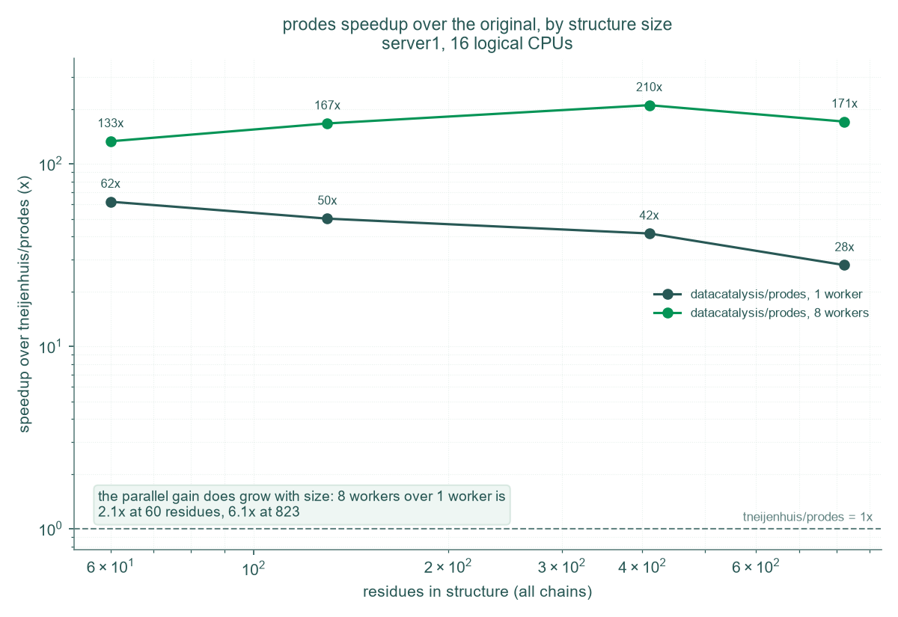
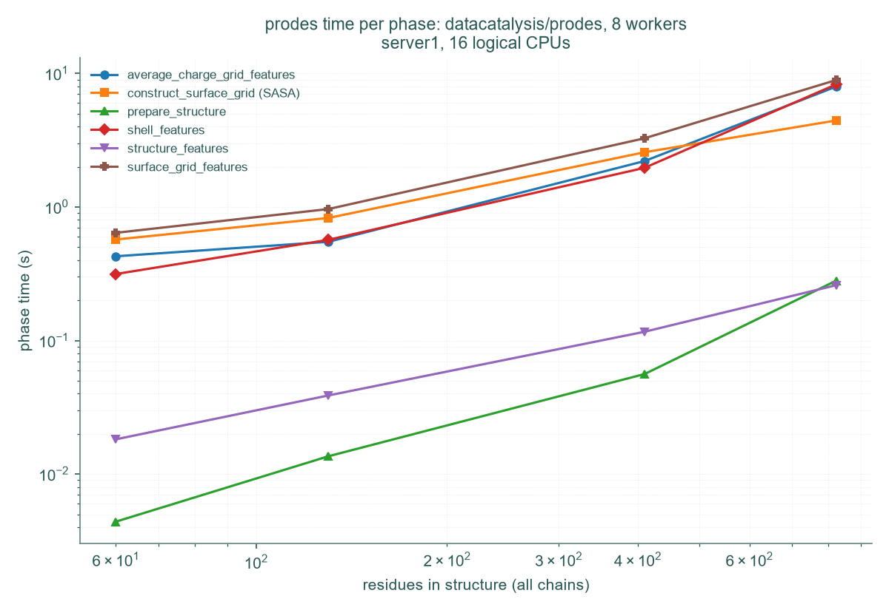

# Benchmark: datacatalysis/prodes vs tneijenhuis/prodes

This folder holds the timing data and figures comparing this fork against the original [tneijenhuis/prodes](https://github.com/tneijenhuis/prodes), measured on the same machine, the same structures and the same pipeline phases.

Headline result on the largest structure in the current test set (1GPB, 823 residues).


## Reproducing the figures

```bash
python scripts/benchmark.py          # measure, writes benchmark_results/ (git ignored)
python scripts/publish_benchmark.py  # anonymise, writes docs/benchmark/benchmark_data.zip
python scripts/plot_benchmark.py     # plot, writes the PNGs in this folder
```

`scripts/benchmark.py` has to be run once under each install, with the interpreter of whichever one is being measured. It detects which implementation it is timing from whether `prodes.parallel` is importable, and writes the resolved package path into every row, so the two cannot be confused. The original has no parallelism and is timed once rather than at several worker counts.

Each run also writes its feature values to `benchmark_results/features/` (currently git ignored), one CSV per structure and worker count, in the same format `calculate()` writes its output.

Neither implementation is given a pKa file, so nothing here needs PROPKA, H++ or pypka installed. That is a deliberate constraint rather than an omission: a pKa file would make both the timings and the feature values depend on the version of whichever external tool produced it, and neither would then be reproducible by anyone who does not have it. See `PKA_FILE` in `scripts/benchmark.py`.

Only the last step is needed to redraw the figures: [`benchmark_data.zip`](benchmark_data.zip) is committed, so every figure here is reproducible from the repository alone, and anyone who wants to plot the numbers differently can unpack it and work from the CSVs.

## Method

| | |
| --- | --- |
| Machine | 16 logical CPUs, Linux 6.8, referred to as `server1` |
| Workers | `PRODES_N_WORKERS=1` for the serial baseline, unset for the default of half the logical cores (8) |
| Memory limit | `PRODES_MEM_LIMIT_MB=16384` |
| Feature set | the full 105-feature set, which is what the original also calculates |
| Parameters | pH 7, probe radius 1.4 A, `mj_scaled` hydrophobicity, no pKa file |
| Phases | timed individually, called with only the arguments the original also accepts |

`PRODES_MEM_LIMIT_MB` caps the size of the intermediate NumPy arrays in the vectorised code, so it directly affects how fast the fork runs and a timing is not meaningful without it. 16384 MB is a deliberately generous setting for a server with plenty of RAM. **The setting does not apply to `tneijenhuis/prodes` at all**, which has no memory limit because it has no vectorised chunking, so the baseline column is unaffected by it.

The feature set is not an environment setting here. `time_pipeline` calls the phase functions directly rather than going through `calculate()`, and calls them the way the original prodes exposes them, which means the full set including the average-charge phase. `PRODES_FULL_FEATURES` is only read by the command line entry point, so it has no effect on these numbers whatever it is set to. The full set is the fair comparison: the original has no reduced mode, so a reduced run would be timing less work against its full one. A default run of this fork does less than what is timed here.

`scripts/benchmark.py` records the environment settings into every row it writes, so runs are self-describing. The `datacatalysis/prodes` rows in the committed archive carry them. The `tneijenhuis/prodes` rows predate that and carry the values above, which are stated here rather than backfilled into the data.

The SASA calculation is charged to `construct_surface_grid`, which is where `shrake_rupley` runs.

### Structures

| Structure | Residues | Heavy atoms | ATOM records | File size |
| --- | ---: | ---: | ---: | ---: |
| ARH96693 | 60 | 479 | 479 | 38 KB |
| 1GDW | 130 | 1022 | 1022 | 81 KB |
| 1GDW_h | 130 | 1022 | 2003 | 158 KB |
| ARH98503 | 410 | 3106 | 3106 | 246 KB |
| 1GPB | 823 | 6699 | 6699 | 530 KB |

All five are single chain, so the residue count is also the total sequence length. Residues are counted as distinct (chain, residue number) pairs, so insertion codes and gapped numbering cannot inflate the total.

1GDW_h is 1GDW with hydrogens added. It is in the dataset but not in the figures, for the reason set out under [Hydrogens](#hydrogens) below.

## Results

Times are plotted against the residue count. That is equivalent to the heavy atom count for this purpose, at a near constant 7.6 to 8.1 heavy atoms per residue across the set.

Both axes are logarithmic.


Fitting a power law over the four distinct structures gives:

| Series | Scaling | R² |
| --- | --- | ---: |
| tneijenhuis/prodes, serial | t ∝ n^1.16 | 0.993 |
| datacatalysis/prodes, 1 worker | t ∝ n^1.44 | 0.991 |
| datacatalysis/prodes, 8 workers | t ∝ n^1.04 | 0.968 |

On one worker the fork scales with a *steeper* exponent than the original while being far faster at every size measured. That is not a contradiction: the original spends 95% of its time in a per-atom Python loop in `shell_features`, whose cost is close to linear in the atom count and swamps everything else. Removing that loop exposes the underlying geometric work, which grows faster than linearly but from a far lower base. Four points over a 14x range is not enough to separate a power law from an exponential, so these exponents describe the measured range and are not an extrapolation beyond it.

### Speedup by structure size is relatively constant due to two effects in opposing directions



The **gain due to parallelisation with multiple workers grows with protein size**, as a larger structure gives each worker more to do against the same fixed cost of starting the pool, so the pool pays for itself more completely.

The **gain from vectorisation shrinks with protein size**, because the two implementations scale differently: n^1.16 against n^1.44. The original is slow everywhere, near uniformly so, while the vectorised code is left doing geometric work that grows faster.

Net, at 8 workers the total speedup over the original stays inside a band of roughly 130x to 210x across the whole range, with no consistent trend either way, rather than rising with size. What does grow is the absolute saving, which is what actually matters when planning a run: ~4 minutes on the smallest structure, ~85 minutes on the largest.

One caution on extrapolating: if the n^1.44 and n^1.16 fits hold, the total speedup will keep eroding for structures larger than anything measured here. The largest here is 823 residues, and the pipeline this feeds routinely sees multimers well above that.

### Where the time goes



On 1GPB the phase profile is what changed most:

| Phase | tneijenhuis/prodes | datacatalysis/prodes, 8 workers |
| --- | ---: | ---: |
| shell_features | 4862 s (94.5%) | 8.3 s (27.5%) |
| construct_surface_grid (SASA) | 142 s (2.8%) | 4.4 s (14.7%) |
| surface_grid_features | 75 s (1.5%) | 8.9 s (29.6%) |
| average_charge_grid_features | 66 s (1.3%) | 8.0 s (26.4%) |
| structure_features | 0.5 s | 0.3 s |
| prepare_structure | 0.2 s | 0.3 s |

The original had a single dominant phase. The fork has three phases of roughly equal cost taking about 27 to 30% each, with SASA at half that since its neighbour arrays are now built once per grid cell, which means there is no longer one obvious place to optimise next.

## Hydrogens

Hydrogens in the input file cost nothing and change nothing.

`Residue.heavy_atoms` filters on `element != "H"` ([`src/prodes/core/residue.py`](../../src/prodes/core/residue.py)), and every downstream calculation works from `heavy_atoms`, so hydrogens are discarded before any of the work starts. 1GDW and 1GDW_h are the same protein, one without hydrogens and one with 981 of them, and the measurements confirm what the code implies:

| | 1GDW | 1GDW_h |
| --- | ---: | ---: |
| File size | 81 KB | 158 KB |
| ATOM records | 1022 | 2003 |
| Heavy atoms | 1022 | 1022 |
| Surface points | 7039 | 7039 |
| Time, 1 worker | 9.85 s | 9.88 s |
| Time, original | 493.6 s | 492.7 s |

Running the full pipeline on both gives **byte-identical output**: every numeric descriptor matches exactly, and only the `ID` column differs. Twice the file size, no extra cost, same answer.

Two consequences worth knowing:

**For a mixed pipeline.** Structures from Boltz-2, AlphaFold and the PDB can be mixed freely regardless of whether they carry hydrogens. The descriptors are a function of the heavy atoms only.

## Files

| File | Contents |
| --- | --- |
| `benchmark_data.zip` | the timing data, one CSV per implementation, one row per phase |
| `benchmark_speedup.png` | speedup over the original on the largest structure |
| `benchmark_speedup_by_size.png` | how that speedup varies across the size range |
| `benchmark_total_time.png` | total time against structure size |
| `benchmark_phases.png` | time per phase for the fastest configuration |
